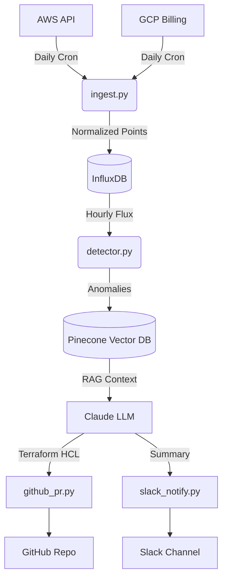

# 01 - Architecture Overview

## The Big Picture

Cloud Cost Optimizer is an end-to-end automated platform designed to combat cloud waste. Instead of sending out daily budget alerts that get ignored, it finds the exact resource causing the spike, researches how to fix it, generates the Terraform code for the fix, and opens a Pull Request.

The pipeline runs continuously with minimal human intervention.

## 6-Stage Pipeline

1. **Cloud Provider APIs:** The system natively pulls daily unblended historical metrics from AWS Cost Explorer, AWS CloudWatch, and GCP BigQuery billing exports.
2. **Data Ingestion Service (`ingest/`):** Normalizes costs and CPU metrics into standard time-series data structures. It attributes a "Waste Score" (0-100) locally over each resource point.
3. **Time-Series Database (InfluxDB):** High-throughput data engine. We use Flux queries to analyze 30-day moving windows for each service.
4. **Knowledge Retrieval (`rag/`):** When a spike is detected, Pinecone searches against a Vector DB containing AWS Well-Architected Framework documentation and historical Terraform modules to pull the exact best practice needed to fix the waste.
5. **Claude Analysis Engine (`actions/terraform_gen.py`):** Deep integration with Anthropic's Claude. It is fed the real-time anomaly metrics AND the retrieved RAG context, to produce an actionable recommendation and valid Terraform code.
6. **Action Pipeline (`actions/`):** Commits the generated infrastructure-as-code into a new Git branch, opens a PR with estimated savings + rollback instructions, and pings the team via Slack.

## The Data Flow

